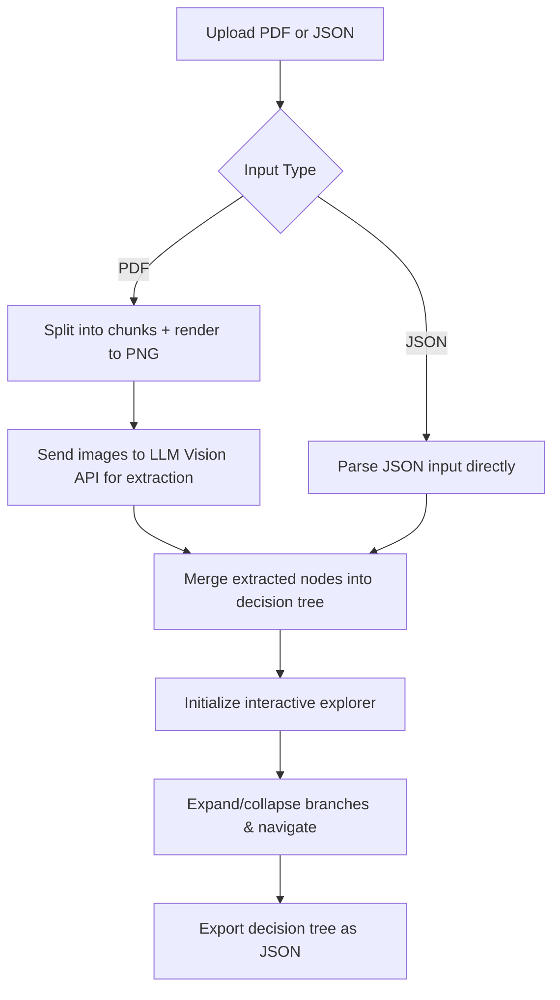

# 🌳 PDF Decision Tree Explorer

A web-based application that transforms **PDF playbooks** into interactive **decision trees** using **LLM + Vision APIs**.  
Users can upload a PDF or JSON, extract structured decision flows, and navigate them visually with expand/collapse controls.  

---

## 🚀 Features

- **PDF / JSON Input** – Upload a playbook PDF or raw JSON.
- **LLM-Powered Extraction** – Split PDF pages, convert to images, and extract decision nodes via OpenRouter LLM Vision API.
- **Tree Explorer** – Navigate decisions, expand/collapse branches, and restart exploration.
- **Live Progress Overlay** – See each PDF chunk being processed in real time.
- **Export Support** – Download the extracted decision tree as JSON.
- **Responsive UI** – Built with **Bootstrap 5** for a clean, modern interface.

---

## ⚡ How It Works
The process flow


1. Upload a PDF (split into chunks + processed via LLM) or provide raw JSON.
2.Extract structured decision nodes following a defined schema.
3.Merge extracted nodes into a unified decision tree.
4.Interactively explore: expand/collapse branches, track history, and restart at any point.
5.Export the final decision tree as JSON for reuse.

---

## 🛠️ Setup & Usage

### 1. Clone the repository
```bash
git clone https://github.com/Nitin399-maker/decisionplaybook.git
cd decisionplaybook
